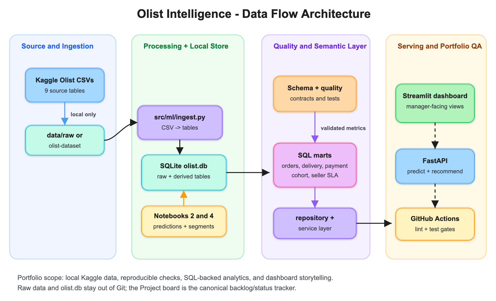

# Olist Mimari Notları

Bu doküman, Olist Intelligence projesinin veri akışını ve uygulama parçalarını
portfolio değerlendirmesi için kısa şekilde açıklar. Proje production veri
platformu iddiası taşımaz; amaç Kaggle verisini yerel bir analitik dashboard,
SQL metrik katmanı ve ML prototipleriyle okunabilir hale getirmektir.

## Mimari Görsel

Excalidraw ile hazırlanan kaynak diyagram
[`docs/diagrams/olist-data-flow.excalidraw.json`](diagrams/olist-data-flow.excalidraw.json)
altında tutulur. GitHub README ve dokümanlarda görünen PNG export
[`docs/diagrams/olist-data-flow.png`](diagrams/olist-data-flow.png) dosyasıdır;
ölçeklenebilir SVG export ise
[`docs/diagrams/olist-data-flow.svg`](diagrams/olist-data-flow.svg) olarak
saklanır.

Diyagramın amacı tek ekranda Kaggle CSV -> ingest -> yerel veritabanı ->
şema/kalite kontrolleri -> SQL marts -> repository/service katmanı ->
Streamlit/FastAPI çıktıları akışını göstermektir. Görseldeki
`Processing + Local Store` kolonu bilinçli olarak iki ayrı işi birlikte
gösterir: ham CSV ingest akışı ve notebook'lardan üretilen türetilmiş tabloların
yerel veritabanına yazılması.

Notebook 2 ve Notebook 4 ayrıca `logistics_predictions` ve
`customer_segments` tablolarını üretir. Bu yüzden ham Olist tabloları dashboard
için temel veriyi sağlar, fakat tüm dashboard sayfalarının dolması için notebook
çıktıları da gerekir.

## Katmanlar

| Katman | Bu projedeki karşılığı | Not |
| --- | --- | --- |
| Kaynak veri | Kaggle Olist CSV dosyaları | Git'e eklenmez; yerelde `olist-intelligence/data/raw/` veya `olist-intelligence/olist-dataset/` altında tutulur. |
| Ingest | `src/ml/ingest.py` | CSV dosyalarını SQLite/Postgres uyumlu tablolara yazar. |
| Veritabanı | `olist.db` veya `DATABASE_URL` | Varsayılan yerel çalışma SQLite kullanır. |
| Veri kontrolü | `scripts/validate_olist_schema.py` | CSV schema, DB schema ve kalite kontrollerini çalıştırır. |
| SQL marts | `olist-intelligence/sql/views/` | Dashboard ve analiz için tekrar kullanılabilir view'lar. |
| Uygulama katmanı | `src/database`, `src/services`, `src/views` | Dashboard sayfalarını ham SQL detayından ayırır. |
| ML prototipleri | `notebooks/`, `src/ml/` | Lojistik, churn, segmentasyon ve öneri deneyleri. |
| Sunum | Streamlit dashboard ve FastAPI endpointleri | Yerel demo ve portfolio anlatımı için. |

## Şu Anda Tamamlanan Parçalar

| Alan | Durum | Dosyalar |
| --- | --- | --- |
| Executive dashboard | Sipariş, ürün geliri, müşteri, gecikme, review, payment mix, cohort retention ve seller SLA sinyalleri var | `olist-intelligence/src/views/home_view.py` |
| SQL metrik katmanı | Order summary, delivery quality, payment mix, review-delivery, seller SLA, cohort retention, seller performance ve segment view'ları var | `olist-intelligence/sql/views/` |
| Kaynak sözleşmesi | Kaggle 9 CSV / 52 kolon beklentisi ve DB kalite kontrolleri var | `olist-intelligence/src/data_contract.py`, `olist-intelligence/tests/test_data_contract.py` |
| SQL mutabakatı | Küçük SQLite fixture ile mart kontrolleri var | `olist-intelligence/tests/test_sql_views.py` |
| Uygulama ayrımı | Repository/service/view yapısı var | `olist-intelligence/src/database/`, `olist-intelligence/src/services/`, `olist-intelligence/src/views/` |
| CI | PR üzerinde lint/test çalışıyor | `.github/workflows/main.yml` |

## Sonraki İşler

Bu liste GitHub Project board'un yerine geçmez; sadece README ve issue yazarken
referans olacak kısa teknik nottur.

| Öncelik | İş | Neden önemli |
| --- | --- | --- |
| P2 | Delivery/repeat-purchase model card | Temporal split, sınıf dengesi kapısı ve model üretmeme kararı belgelenir. |
| P2 | Review text NLP deneyi | Portekizce yorumlardan sınırlı ama açıklanabilir issue bucket'ları çıkarılabilir. |
| P2 | Category/geolocation analytics | Olist'in kategori ve konum tabloları dashboard/analiz tarafında daha iyi kullanılabilir. |
