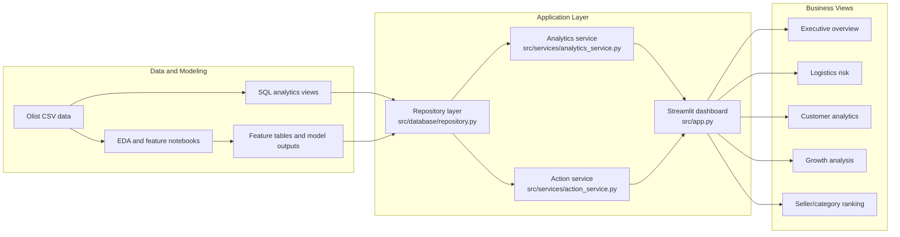

# Project Architecture

Bu doküman, Olist e-ticaret projesinin portfolio açısından hangi parçaları gösterdiğini kısa ve görsel şekilde anlatır. Proje üretim seviyesi bir platform iddiası taşımaz; amaç veri hazırlama, SQL tabanlı analitik modelleme, dashboard anlatımı ve ML çıktısını aksiyona dönüştürme pratiğini göstermektir.

## Data and Application Flow

## What Is Already Done

| Area | Completed work | Files |
| --- | --- | --- |
| Executive analytics | Manager-facing dashboard with orders, revenue, customer count, late delivery rate and review score | `olist-intelligence/src/views/home_view.py` |
| SQL layer | Reusable SQL views for order summary, delivery quality, seller performance and customer segments | `olist-intelligence/sql/views/` |
| Data contract | Kaggle CSV/table schema and stable DB quality checks | `olist-intelligence/src/data_contract.py`, `olist-intelligence/tests/test_data_contract.py` |
| App data access | Repository/service structure to keep dashboard pages away from raw query details | `olist-intelligence/src/database/repository.py`, `olist-intelligence/src/services/analytics_service.py` |
| ML prototypes | Feature, training, registry and benchmark modules for delivery/customer experiments | `olist-intelligence/src/ml/` |
| CI and checks | GitHub Actions runs tests and Python syntax checks on PRs | `.github/workflows/main.yml` |

## Realistic Next Backlog

| Priority | Work | Why it matters |
| --- | --- | --- |
| P1 | Payment and review-delivery marts | Adds manager-facing drivers without relying on ad hoc notebook logic. |
| P1 | Customer cohort and retention view | Converts the broad customer analysis into a clearer analytics story. |
| P1 | Review sentiment prototype | The Olist review comments can support a small NLP feature, but it should be scoped as an experiment because the text is Portuguese. |
| P2 | dbt-style model docs | Documents view ownership, source tables, grain and metric caveats without adding a full dbt setup. |
| P2 | Dashboard walkthrough screenshots | Add only after local data is loaded and Browser QA confirms the charts render correctly. |
