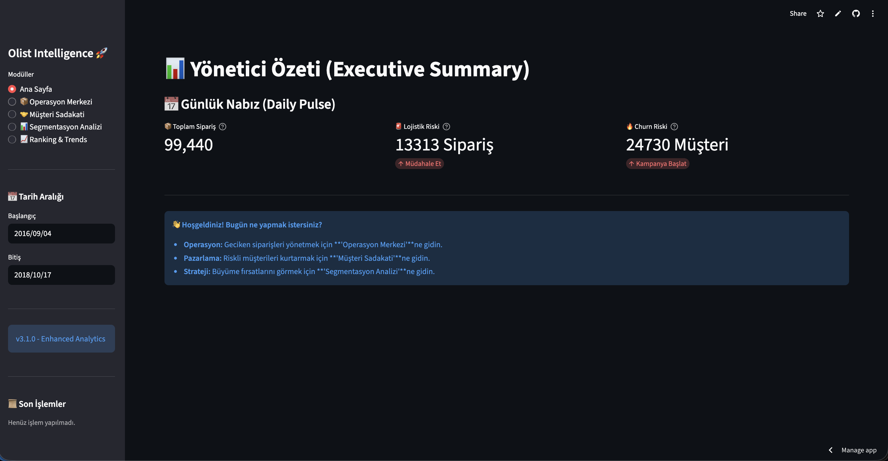
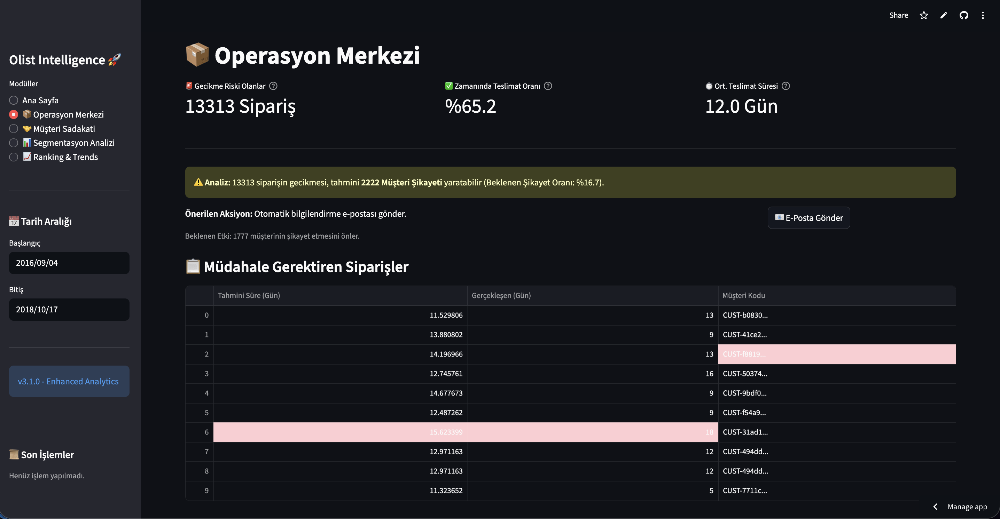
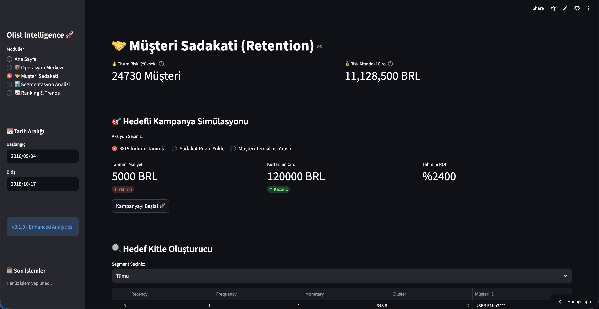
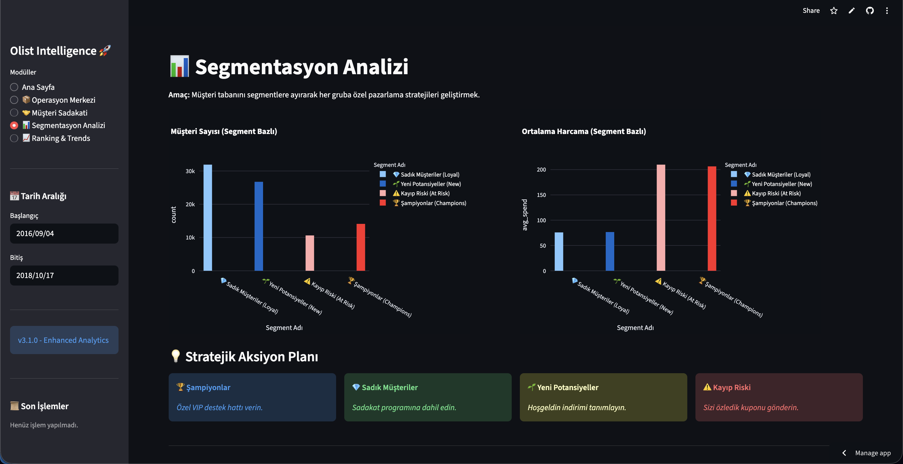
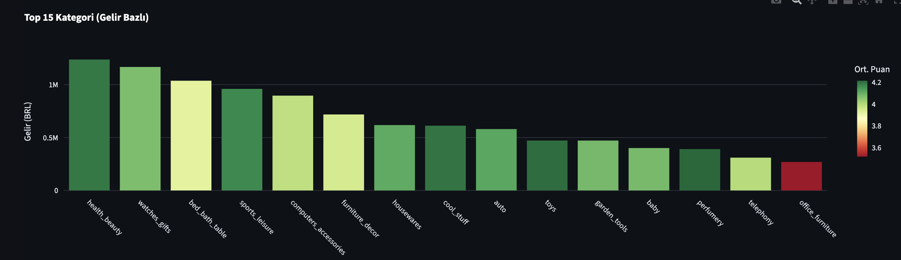
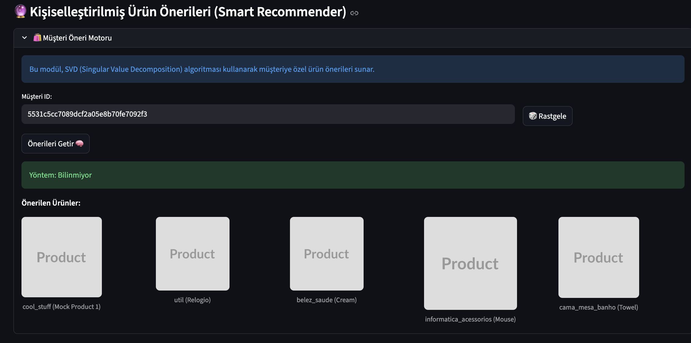

# Olist Intelligence Suite
[](https://zero2end-ml-bootcamp.streamlit.app/)

Brezilya'nın en büyük e-ticaret platformu Olist'in verilerini kullanarak geliştirilmiş uçtan uca Veri Bilimi ve İş Zekası çözümü.

Brezilya'nın en büyük e-ticaret platformu Olist'in verilerini kullanarak geliştirilmiş uçtan uca Veri Bilimi ve İş Zekası çözümü.

> [!NOTE]
> Bu proje, **Miuul Data Science Bootcamp** bitirme projesi kapsamında verilen talimatlara uygun olarak hazırlanmıştır.
> 📄 [Bootcamp Proje Talimatlarını İncele (PDF)](docs/reports/Zero2End_ML_Bootcamp_Project_Report.pdf)

## ✅ Proje Gereksinimleri ve Karşılanma Durumu

Proje talimatlarında belirtilen kriterlerin tamamı başarıyla uygulanmıştır:

| Gereksinim | Durum | Uygulama Detayı |
|------------|-------|-----------------|
| **Veri Analizi (EDA)** | ✅ Tamamlandı | Notebook 1'de detaylı veri keşfi ve temizliği yapıldı. |
| **Model Geliştirme** | ✅ Tamamlandı | CatBoost (Lojistik & Churn) ve SVD (Öneri) modelleri eğitildi. |
| **Pipeline Kurulumu** | ✅ Tamamlandı | Veri indirme -> İşleme -> Eğitim -> Tahmin akışı otomatize edildi (`ingest.py`). |
| **Deployment** | ✅ Tamamlandı | Streamlit kullanarak interaktif dashboard geliştirildi ve Cloud'a yüklendi. |
| **Kod Kalitesi** | ✅ Tamamlandı | Modüler yapı (`src/`), OOP prensipleri ve Docstring kullanımı. |
| **Raporlama** | ✅ Tamamlandı | Readme dosyası ve Notebook içi Markdown açıklamaları ile süreç dökümante edildi. |


| **Ana Sayfa (Dashboard)** | **Operasyon Merkezi** |
|:---:|:---:|
|  |  |

| **Müşteri Sadakati (Retention)** | **Segmentasyon Analizi** |
|:---:|:---:|
|  |  |

| **Ranking & Trends** | **Ürün Öneri Motoru** |
|:---:|:---:|
|  |  |

---

## Problem & Çözüm

### Problem 1: Teslimat Gecikmesi
**Sorun:** Müşteriler siparişlerin ne zaman geleceğini bilemiyor, gecikmeler şikayete dönüşüyor.  
**Çözüm:** CatBoost modeli ile teslimat süresi tahmini (RMSE: 7.60 gün)

**Neden Bu Yaklaşım?**
*   Haversine mesafe (satıcı-müşteri arası) en önemli faktör
*   Satıcı puanı (review verisi) teslimat performansıyla ilişkili
*   Aynı eyalet = daha hızlı teslimat

### Problem 2: Müşteri Kaybı (Churn)
**Sorun:** Hangi müşterilerin platformu terk edeceğini önceden tahmin edemiyoruz.  
**Tanım Nedir?:** *Churn*, bir müşterinin platformu kullanmayı bırakması (terk etmesi) demektir.  
**Bizdeki Karşılığı:** 90 gün boyunca hiç sipariş vermeyen müşteri, sistemimiz tarafından **"Churn" (Kaybedilmiş)** olarak etiketlenir.
**Çözüm:** CatBoost Classifier ile bu riski taşıyan müşterileri erkenden tespit etmek.

**Neden Bu Yaklaşım?**
*   İlk yaklaşımda AUC %100 çıkıyordu - bu data leakage'dı (Düzeltildi)
*   Cluster'dan türetilen target gerçekçi değildi
*   Gerçek tanım: %80.3 Churn Rate (anlamlı)

### Problem 3: Müşteri Tek Tip Görülüyor
**Sorun:** Tüm müşterilere aynı pazarlama yapılıyor.  
**Çözüm:** RFM + K-Means ile segmentasyon (5 segment)

---

## Teknoloji Tercihleri

| Teknoloji | Neden? |
|-----------|--------|
| **SQLite** | Local geliştirme ve taşınabilirlik için ideal (Konfigürasyon gerektirmez) |
| **Streamlit** | React ile aylar sürecek işi günlere indirir |
| **Docker** | "Benim bilgisayarımda çalışıyordu" problemini çözer |
| **Polars** | ETL'de Pandas'tan 10x hızlı |
| **FastAPI** | Modern, async, otomatik dokümantasyon (Backend API) |

---

## Özellikler

### Lojistik Tahmin
*   **RMSE:** 7.60 gün
*   **Özellikler:** Mesafe, kargo, fiyat, ağırlık, satıcı puanı

### Churn Tahmini
*   **Rate:** %80.3 (Marketplace doğası gereği yüksek)
*   **Tanım:** 90 gün sipariş yok = Churn

### Müşteri Segmentasyonu
*   **5 Segment:** Şampiyonlar, Sadıklar, Potansiyeller, Riskli, Uyuyanlar

### Dashboard
*   **5 Sayfa:** Ana Sayfa, Operasyon, Müşteri, Segmentasyon, Ranking
*   **ROI Simülasyonu:** Kampanya maliyet/getiri analizi

### API
*   **4 Endpoint:** `/predict/delivery`, `/predict/churn`, `/recommend`, `/segments`
*   **Güvenlik:** X-API-KEY koruması

---

## 🚀 Kurulum ve Çalıştırma

Proje hem Yerel (Local) hem de Docker ortamında çalışacak şekilde tasarlanmıştır.

### Ön Gereksinimler
*   Docker & Docker Compose (Önerilen)
*   Git
*   Python 3.10+ (Yerel çalışma için)

### Adım 1: Projeyi İndir
```bash
git clone https://github.com/vamos99/Zero2End-ML-Bootcamp.git
```

### Adım 2: Python Ortamını Kurun (Sadece Yerel Çalışma İçin)
Projenin bağımlılıklarını izole etmek için sanal ortam kurmanız önerilir:

```bash
# Sanal Ortam Oluştur
python -m venv venv

# Aktif Et (Mac/Linux)
source venv/bin/activate
# Aktif Et (Windows)
# .\venv\Scripts\activate

# Kütüphaneleri Yükle
pip install -r requirements.txt

# Kernel'i Notebook'a Tanıt (ÖNEMLİ)
python -m ipykernel install --user --name=venv --display-name "Python (Olist Project)"
```

### Adım 3: Ortam Değişkenlerini Ayarla (.env)
Projenin çalışması için bir `.env` dosyası oluşturun (Örnek dosyadan kopyalayabilirsiniz). Notebooklar ve Docker bu dosyayı kullanır.

```bash
# MacOS/Linux
cp .env.example .env
# Windows
copy .env.example .env
```
Ardından `.env` dosyasını açıp **KAGGLE_USERNAME** ve **KAGGLE_KEY** bilgilerinizi ekleyin (Veri indirmek için gereklidir).

### Adım 4: Veri Hazırlığı ve Modeller
Proje açıldığında API çalışır (`.pkl` modelleri hazır gelir). Ancak **Dashboard grafiklerinin** dolması için geçmiş tahminlerin üretilmesi gerekir.

**Sırayla Çalıştırın:**
1.  `notebooks/1_general_eda_and_prep.ipynb`: **(Zorunlu)** Veritabanı boşsa [Kaggle Olist Dataset](https://www.kaggle.com/datasets/olistbr/brazilian-ecommerce) verisini indirir ve SQL tablolarını kurar.
2.  `notebooks/2_logistics_engine.ipynb`: **(Gerekli)** Dashboard'daki "Operasyon" ekranının dolması için lojistik tahminlerini veritabanına yazar.
3.  `notebooks/3_customer_sentinel.ipynb`: **(Gerekli)** Churn modelini eğitir ve analiz eder.
4.  `notebooks/4_growth_engine.ipynb`: **(Gerekli)** Dashboard'daki "Müşteri" ekranının dolması için segmentasyon verilerini veritabanına yazar.

**İsteğe Bağlı Analizler (Opsiyonel):**
*   `notebooks/5_final_evaluation.ipynb`: Tüm modellerin toplu performans karşılaştırması.
*   `notebooks/6_executive_pipeline.ipynb`: Yeni gelen haftalık verinin nasıl işleneceğini simüle eden pipeline.
*Not: Veritabanı (`olist.db`) bu işlem sonunda dolacaktır.*

### Seçenek A: Docker ile Başlatma (Önerilen)
Tüm servisleri (API, Dashboard, MLflow) tek komutla başlatın.

```bash
docker-compose up --build
```

### Seçenek B: Hızlı Başlangıç (Script ile)
Tek komutla MLflow, API ve Dashboard'u aynı anda başlatın:

```bash
chmod +x run_local.sh
./run_local.sh
```

### Seçenek C: Manuel (Adım Adım)
Eğer her servisi ayrı terminalde görmek isterseniz:

1. **Terminal 1: MLflow Arayüzü (Zorunlu)**
   ```bash
   mlflow ui --port 5000
   ```
   *(Bunu başlatmazsanız API modelleri yükleyemez ve açılmaz)*

2. **Terminal 2: API**
   ```bash
   uvicorn src.app:app --reload
   ```

3. **Terminal 3: Dashboard**
   ```bash
   streamlit run src/dashboard.py
   ```

---

## Notebook'ları Çalıştırma (Geliştirme)

Analiz yapmak için yerel Python ortamınıza bağımlılıkları yüklediğinizden emin olun (Adım 2'deki gibi).
Notebooklar `.env` dosyasındaki ayarları otomatik okur.

```bash
cd notebooks
jupyter lab
```

---

## Dosya Yapısı

```
src/
├── app.py          # FastAPI Backend
├── dashboard.py    # Streamlit Frontend
├── ml/             # ML Core (Eğitim, Ingestion)
│   ├── ingest.py   # CSV → SQLite
│   └── train.py    # Model Eğitimi
├── services/       # İş Mantığı (Service Layer)
├── views/          # Dashboard Sayfaları
└── database/       # Veritabanı Bağlantısı

notebooks/
├── 1_general_eda_and_prep.ipynb  # Veri keşfi ve Yükleme
├── 2_logistics_engine.ipynb      # Teslimat modeli eğitimi
├── 3_customer_sentinel.ipynb     # Churn analizi
├── 4_growth_engine.ipynb         # Segmentasyon modeli
└── ...

data/               # CSV dosyaları (Git-ignored)
models/             # Eğitilmiş modeller (.pkl)
docs/               # Proje dökümanları ve görseller
```

## Model Performansı

| Model | Algoritma | Metrik | Değer |
|-------|-----------|--------|-------|
| **Lojistik** | CatBoost Regressor | RMSE | ~7.6 Gün |
| **Churn** | CatBoost Classifier | Accuracy | ~%90 (Imbalanced) |
| **Recommender** | SVD | Coverage | 99K User |

---

### Troubleshooting (Sorun Giderme)

*   **API Bağlantı Hatası:** MacOS kullanıcıları `localhost` yerine `127.0.0.1` kullanmalıdır (Projede varsayılan olarak ayarlanmıştır).
*   **Grafikler/Tablolar Boş Görünüyor:**
    *   **Durum:** API ve Simülasyonlar çalışıyor (`.pkl` modelleri hazır geldiği için).
    *   **Çözüm:** Dashboard'daki *"Operasyon Merkezi"* gibi geçmişe dönük analizlerin dolması için veritabanında tahmin tablolarının oluşması şarttır. Bunu sağlamak için **Notebook 2 (Lojistik)** ve **Notebook 4 (Churn)** dosyalarını bir kez çalıştırmanız yeterlidir.
*   **Docker Port Hatası:** Yerelde çalışan servisleri (`Ctrl+C`) kapatıp `docker-compose`'u yeniden başlatın.

---
**Versiyon:** 2.1 | **Güncelleme:** Aralık 2025
