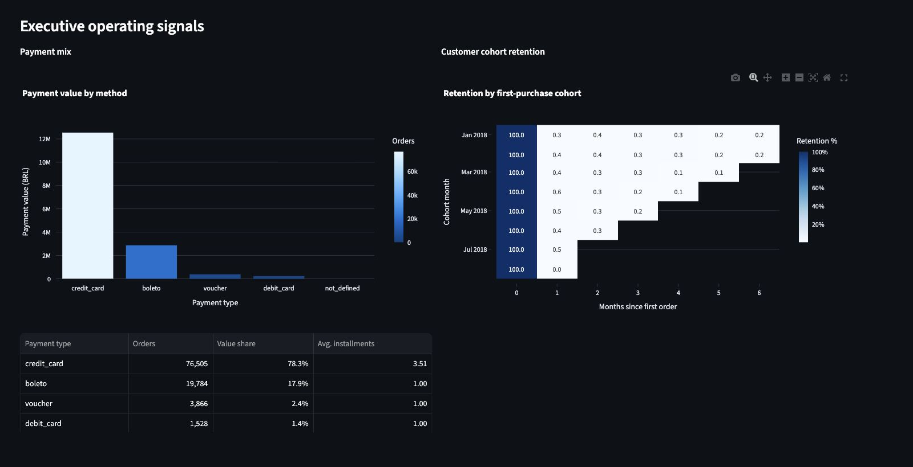
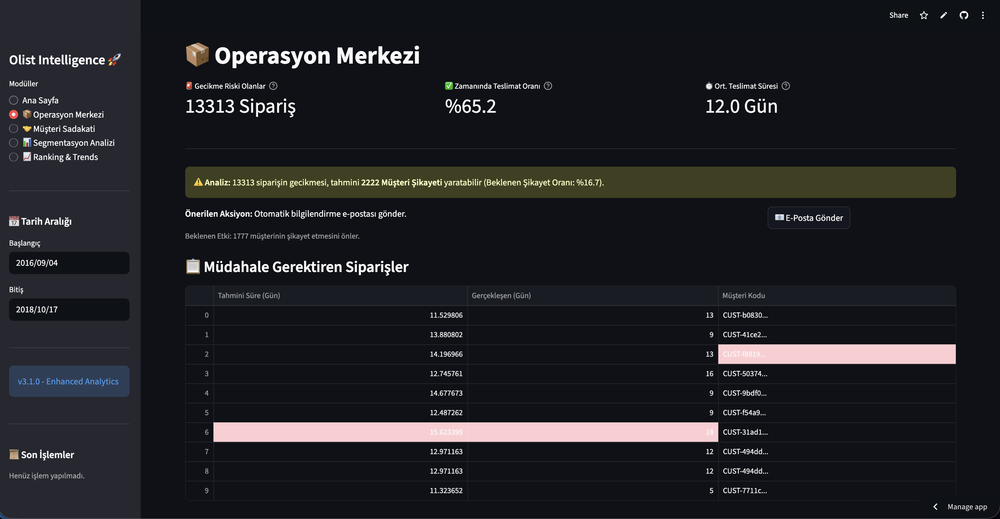
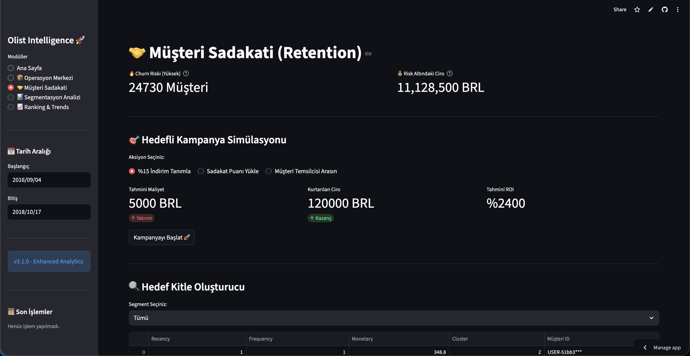
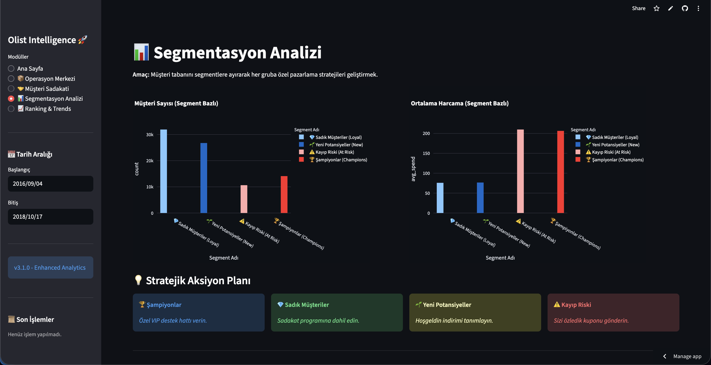
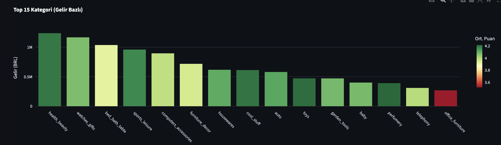
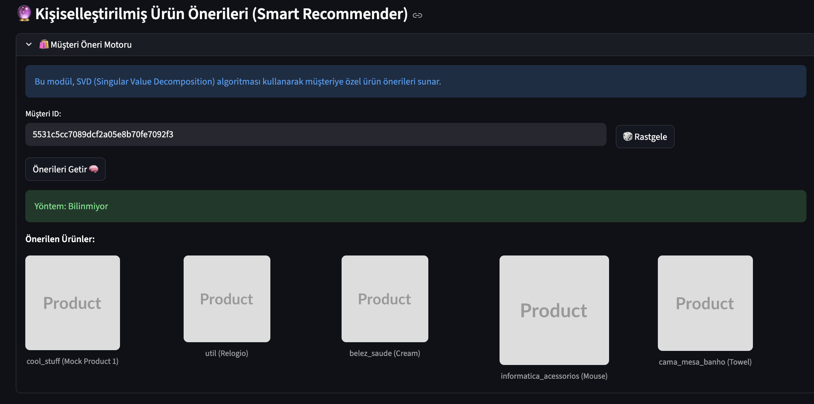

# Olist Intelligence Suite

Olist e-ticaret veri seti ile hazırlanmış analitik dashboard ve ML workflow prototipi. Proje; veri hazırlama, SQL ile yeniden kullanılabilir metrik mantığı, tahmin servisleri ve teknik olmayan kullanıcı için karar odaklı dashboard anlatımını bir araya getirir.

> [!NOTE]
> Bu proje, **Zero2End ML Bootcamp** bitirme projesi kapsamında verilen talimatlara uygun olarak hazırlanmıştır.
> 📄 [Bootcamp Proje Talimatlarını İncele (PDF)](docs/reports/Zero2End_ML_Bootcamp_Project_Report.pdf)

## Proje Kapsamı ve Mevcut Durum

Proje bootcamp bitirme kapsamını karşılar; production seviyesinde servis veya canlı veri platformu iddiası taşımaz. Dashboard, Kaggle verisi, model çıktıları ve ortam değişkenleri hazır olduğunda anlamlıdır.

| Gereksinim | Durum | Uygulama Detayı |
|------------|-------|-----------------|
| **Veri Analizi (EDA)** | Uygulandı | Notebook 1'de veri keşfi ve hazırlık adımları yer alır. |
| **Model Geliştirme** | Prototip | CatBoost lojistik modeli, repeat-purchase/churn uygunluk kapısı ve SVD öneri yaklaşımı notebook ve `src/ml/` altında tutulur. |
| **Pipeline Kurulumu** | Yerel akış | Kaggle CSV -> SQLite/Postgres uyumlu tablo akışı `ingest.py` ile hazırlanmıştır. |
| **Dashboard** | Ortam bağımlı | Streamlit dashboard yerel veritabanı ve üretilmiş tahmin/segment tabloları hazırsa dolu çalışır. |
| **Kod Kalitesi** | Geliştiriliyor | `src/` modüler yapı, testler, schema contract ve SQL reconciliation kontrolleri vardır. |
| **Raporlama** | Geliştiriliyor | README, notebook açıklamaları, SQL metric docs ve PM/backlog notları birlikte tutulur. |
| **Analitik SQL Katmanı** | Eklendi | `sql/views/` altında dashboard ve veri modeli için tekrar kullanılabilir view örnekleri. |

## Ölçülen Sonuçlar Nasıl Okunmalı?

Bu projede canlı operasyon veya A/B test olmadığı için "teslim süresi X%
kısaldı" ya da "churn X% azaldı" iddiası yoktur. Ölçülen sayılar üç gruba
ayrılır: kaynak verideki mevcut durum, offline model benchmark'ı ve gelecekteki
deneyler için scenario hedefi.

Son local ölçüm (`scripts/evaluate_olist_results.py --pretty`, 2026-06-30):

Kısa cevap: **gerçek teslimat süresi, churn veya satış etkisi henüz
iyileştirildi diye sunulmuyor**. Ölçülen iyileşme delivery ve recommender
tarafında offline benchmark iyileşmesidir; retention/churn tarafında ise
iyileşme değil, modelleme uygunluk kapısı raporlanır.

| Alan | Mevcut durum / baseline | Model veya hedef sonucu | Güvenli yorum |
| --- | ---: | ---: | --- |
| Delivery source | %6.77 geç teslimat; ortalama 12.56 gün teslimat | Müdahale sonrası ölçüm yok | Lojistik fırsat büyüklüğü |
| Delivery prediction | Train-mean MAE 7.68 gün; Olist estimated-date MAE 12.59 gün | CatBoost MAE 6.52 gün | Tahmin hatası %15.1 / %48.2 düştü; teslimat süresi düştü demek değildir |
| Repeat purchase | %3.00 repeat customer; %97.00 one-time customer | Churn/retention uplift ölçülmedi | Cohort retention daha güvenilir davranış metriği |
| Churn gate | Risk etiketi %99.40; sınıf dağılımı aşırı dengesiz | Model evaluation gate failed | Decision-ready churn modeli olarak sunulmaz |
| Recommender | Random hit@10 %0.03 | SVD hit@10 %3.51, 115.7x random baseline | Ranking benchmark'ı var; satış uplift'i yok |
| Executive analytics | Credit card payment share %78.34; month-1 retention %5.20 | 2,970 seller SLA rows; 93,358 segmented customers | SQL mart/generated-output kanıtı var; impact iddiası yok |
| Scenario hedefi | %6.77 geç teslimat | %6.10 geç teslimat, 653 geç sipariş önleme varsayımı | Gelecek deney hedefi, gerçekleşmiş impact değil |

Kod tarafında aynı ayrım `scripts/evaluate_olist_results.py` içindeki
`outcome_scorecard` ve `evidence_rows` çıktılarıyla yeniden üretilir. NB5 ve
NB6 bu çıktıları doğrudan kullanır. Dashboard ana sayfası da hafif
`outcome_scorecard` tablosuyla gerçek impact, source baseline ve scenario
hedeflerini ayrı gösterir.


| **Ana Sayfa (Dashboard)** | **Operasyon Merkezi** |
|:---:|:---:|
|  |  |

| **Müşteri Sadakati (Retention)** | **Segmentasyon Analizi** |
|:---:|:---:|
|  |  |

| **Ranking & Trends** | **Ürün Öneri Motoru** |
|:---:|:---:|
|  |  |

---

## Problem & Çözüm

### Problem 1: Teslimat Gecikmesi
**Sorun:** Müşteriler siparişlerin ne zaman geleceğini bilemiyor, gecikmeler şikayete dönüşüyor.  
**Çözüm:** CatBoost modeli ile teslimat süresi tahmini prototipi. Performans
değeri yalnızca zaman bazlı holdout yeniden çalıştırıldığında raporlanır.
Ölçülen sonuçlar delivery operasyonunun kısaldığını değil, train-mean ve
Olist estimated-date baseline'larına göre offline tahmin hatasını gösterir.

**Neden Bu Yaklaşım?**
*   Haversine mesafe (satıcı-müşteri arası) en önemli faktör
*   Satıcı puanı (review verisi) teslimat performansıyla ilişkili
*   Aynı eyalet = daha hızlı teslimat

### Problem 2: Müşteri Kaybı (Churn)
**Sorun:** Hangi müşterilerin platformu terk edeceğini önceden tahmin edemiyoruz.  
**Tanım Nedir?:** *Churn*, bir müşterinin platformu kullanmayı bırakması (terk etmesi) demektir.  
**Bizdeki Karşılığı:** 90 gün boyunca hiç sipariş vermeyen müşteri, analizde **riskli/kaybedilmiş** olarak etiketlenir.
**Çözüm:** Gelecek 90 günlük tekrar satın alma etiketiyle modelleme uygunluğu
denetlenir. Sınıflar aşırı dengesizse model eğitimi ve artefact kaydı atlanır.

**Neden Bu Yaklaşım?**
*   `customer_unique_id`, tekrar satın alma ve retention analizinde `customer_id`'den daha anlamlıdır
*   90 gün kuralı gerçek churn değil, operasyonel tekrar-satın-alma etiketidir
*   Mevcut Olist dağılımında azınlık sınıfı çok küçükse predictive model yerine cohort retention analitiği tercih edilir

### Problem 3: Müşteri Tek Tip Görülüyor
**Sorun:** Tüm müşterilere aynı pazarlama yapılıyor.  
**Çözüm:** RFM + K-Means ile dört göreli segmentasyon profili

## Analytics & Data Engineering Açısı

Bu proje production seviyesinde bir veri platformu iddiası taşımaz; bootcamp kapsamındaki veri setini daha okunabilir bir analitik ürüne dönüştürmeyi hedefler. Mimari anlatım için güncel doküman
[`docs/ARCHITECTURE.md`](docs/ARCHITECTURE.md), düzenlenebilir çizim kaynağı ise
[`docs/architecture.excalidraw`](docs/architecture.excalidraw) dosyasıdır.

Proje durumunu ve teknik sınırları doğrulamak için:

- [Dataset ve local data politikası](docs/DATASET.md)
- [Güncel mimari ve modül sorumlulukları](docs/ARCHITECTURE.md)
- [Ölçülen sonuçlar ve model/analytics metrikleri](docs/RESULTS.md)
- [Tamamlanan işler ve gelecek roadmap](docs/ROADMAP.md)
- [Validation komutları](docs/VALIDATION.md)
- [Model kartları ve sınırlamalar](docs/MODEL_CARDS.md)

Testler raw dataset veya aktif API anahtarı gerektirmeyen mock/fixture
sözleşmeleriyle CI üzerinde çalışır:

```bash
pytest tests/ -v --tb=short
```

| Katman | Bu Projede Karşılığı |
|--------|-----------------------|
| **Raw data** | Kaggle Olist CSV dosyaları (`data/raw/` önerilir, `olist-dataset/` legacy fallback; Git'e dahil değil) |
| **Ingestion** | `src/ml/ingest.py` ile CSV -> SQLite/Postgres uyumlu tablo akışı |
| **Analytics model** | `sql/views/` altında revenue, delivery quality, payment, cohort, seller ve segment view'ları |
| **ML workflow** | Notebooklar ve `src/ml/` altında lojistik tahmin, repeat-purchase uygunluk kapısı ve öneri prototipleri |
| **Serving** | FastAPI endpointleri ve SQL mart destekli Streamlit dashboard |
| **Quality checks** | Pytest, schema contract, data-quality checks ve GitHub Actions CI |

### SQL View'ları

SQL dosyaları, dashboard metriklerinin nasıl yeniden kullanılabilir analitik çıktılara çevrilebileceğini göstermek için eklendi.

```bash
python scripts/apply_sql_views.py --replace
```

Bu komut, lokal `olist.db` veya `DATABASE_URL` ile tanımlanmış veritabanı üzerinde `sql/views/` altındaki view'ları uygular.

Veri ve tablo kalitesini kontrol etmek için:

```bash
python scripts/validate_olist_schema.py --target csv
python scripts/validate_olist_schema.py --target db
python scripts/validate_olist_schema.py --target quality
python scripts/build_local_demo.py
python scripts/validate_olist_schema.py --target generated
```

Raw CSV veya `olist.db` yoksa bu komutların fail vermesi beklenen davranıştır; önce Kaggle verisi indirilip ingest akışı çalıştırılmalıdır.

---

## Teknoloji Tercihleri

| Teknoloji | Neden? |
|-----------|--------|
| **SQLite** | Local geliştirme ve taşınabilirlik için ideal (Konfigürasyon gerektirmez) |
| **SQL Views** | Dashboard metriklerini notebook dışına çıkarıp tekrar kullanılabilir hale getirir |
| **Streamlit** | Dashboard prototipini hızlı ve okunabilir şekilde sunar |
| **Docker** | "Benim bilgisayarımda çalışıyordu" problemini çözer |
| **Polars** | CSV okuma/yazma tarafında hızlı ve pratik alternatif |
| **FastAPI** | Modern, async, otomatik dokümantasyon (Backend API) |

---

## Özellikler

### Lojistik Tahmin
*   **RMSE:** Zaman bazlı holdout yeniden çalıştırıldığında üretilir
*   **Özellikler:** Mesafe, kargo, fiyat, ağırlık, satıcı puanı

### Churn Tahmini
*   **Tanım:** Gelecek 90 günde sipariş yok = tekrar-satın-alma risk etiketi
*   **Not:** Sınıf dengesi uygun değilse model bilinçli olarak üretilmez

### Müşteri Segmentasyonu
*   **4 Göreli Profil:** Champions, Loyal, Developing, At Risk

### Dashboard
*   **5 Sayfa:** Executive overview, Operasyon, Müşteri, Segmentasyon, Ranking
*   **Executive signals:** Payment mix, cohort retention, seller SLA ve baseline/scenario kartları SQL martlardan veya hızlı DB sorgularından beslenir
*   **Aksiyon hipotezleri:** Kampanya fikirleri ölçülmüş ROI değil, deney backlog'udur

### API
*   **Liveness/readiness:** `/health`, `/ready`
*   **Serving:** `/predict/delivery`, `/predict/churn`, `/recommend`, `/segments`
*   **Güvenlik:** X-API-KEY koruması

### Data Quality
*   **Schema contract:** Kaggle Olist'in 9 CSV / 52 kolon beklentisi `src/data_contract.py` altında tanımlıdır.
*   **DB kalite kontrolleri:** Boş tablo, duplicate key, orphan foreign key, kabul edilen status/payment değerleri, negatif ödeme/fiyat ve imkansız teslimat tarihleri kontrol edilir.
*   **Analytics marts:** Payment mix, review-delivery driver, seller SLA ve cohort retention view'ları yönetici dashboard akışında kullanılır.

### Dashboard Kaynak Eşlemesi

| Dashboard bloğu | Kaynak |
|-----------------|--------|
| Revenue by customer state | `orders`, `order_items`, `customers` |
| Review score vs. delivery quality | `orders`, `order_reviews` |
| Payment mix | `payment_mix_summary` |
| Customer cohort retention | `customer_cohort_retention` |
| Seller SLA watchlist | `seller_sla_summary` |

---

## 🚀 Kurulum ve Çalıştırma

Proje hem Yerel (Local) hem de Docker ortamında çalışacak şekilde tasarlanmıştır.

### Ön Gereksinimler
*   Docker & Docker Compose (Önerilen)
*   Git
*   Python 3.10+ (Yerel çalışma için)

### Adım 1: Projeyi İndir
```bash
git clone https://github.com/vamos99/Zero2End-ML-Bootcamp.git
cd Zero2End-ML-Bootcamp/olist-intelligence
```

### Adım 2: Python Ortamını Kurun (Sadece Yerel Çalışma İçin)
Projenin bağımlılıklarını izole etmek için sanal ortam kurmanız önerilir:

```bash
# Sanal Ortam Oluştur
python -m venv venv

# Aktif Et (Mac/Linux)
source venv/bin/activate
# Aktif Et (Windows)
# .\venv\Scripts\activate

# Kütüphaneleri Yükle
pip install -r requirements.txt

# Kernel'i Notebook'a Tanıt (ÖNEMLİ)
python -m ipykernel install --user --name=venv --display-name "Python (Olist Project)"
```

### Adım 3: Ortam Değişkenlerini Ayarla (.env)
Projenin çalışması için bir `.env` dosyası oluşturun (Örnek dosyadan kopyalayabilirsiniz). Notebooklar ve Docker bu dosyayı kullanır.

```bash
# MacOS/Linux
cp .env.example .env
# Windows
copy .env.example .env
```
Ardından `.env` dosyasını açıp **KAGGLE_USERNAME** ve **KAGGLE_KEY** bilgilerinizi ekleyin (Veri indirmek için gereklidir).
Yerel API ve dashboard için aynı `API_KEY` değerini kullanın. Dataset farklı
bir klasördeyse `DATA_RAW_PATH` ile göreli veya mutlak yolu belirtebilirsiniz.

### Adım 4: Dataset ve Veritabanı Hazırlığı
Proje raw dataset veya `olist.db` dosyasını GitHub'a yüklemez. Yeni indiren
kullanıcı veriyi kendi ortamında hazırlamalıdır.

**Otomatik Kaggle indirme:**

`.env` içindeki Kaggle bilgileri doğruysa `src.ml.ingest` akışı dataset yokken
Kaggle'dan indirmeyi dener, CSV dosyalarını `data/raw/` altında tutar ve
varsayılan olarak `olist.db` SQLite dosyasını oluşturur.

```bash
python -m src.ml.ingest
```

**Manuel indirme:**

Kaggle'dan [Brazilian E-Commerce Public Dataset by Olist](https://www.kaggle.com/datasets/olistbr/brazilian-ecommerce)
verisini indirip zip'i açın. CSV dosyalarını şu klasöre koyun:

```text
olist-intelligence/data/raw/
```

Ardından aynı ingest komutunu çalıştırın:

```bash
python -m src.ml.ingest
```

**Kontrol ve SQL view kurulumu:**

```bash
python scripts/validate_olist_schema.py --target csv
python scripts/validate_olist_schema.py --target db
python scripts/validate_olist_schema.py --target quality
python scripts/apply_sql_views.py --replace
```

Bu adımlar geçince ham Olist tabloları ve SQL analitik view'ları yerel
veritabanında hazır olur.

**Runtime readiness kontrolü:**

API çalışırken `/ready` çıktısı veritabanı/generated tablo hazır olma durumunu
ve yüklenen model artefact'larını ayrı ayrı gösterir:

```bash
curl http://127.0.0.1:8000/ready
```

`generated_tables` değerlerinin hazır olması dashboard tablolarının beslendiğini,
`loaded_models` ise API model endpointlerinin gerçekten model artefact'ı bulduğunu
gösterir. Bu iki durum aynı şey değildir.

### Adım 5: Notebooklar ve Modeller
API ve dashboard, raw tablolar hazırken başlatılabilir; model endpointleri ve
üretilen dashboard tabloları için ilgili local artefact'ların ayrıca oluşturulması gerekir.
`models/` altındaki `.pkl` dosyaları Git'e ve Docker image build'lerine dahil
edilmez. Bu yüzden ilk kurulumda model dosyaları yoksa API açılabilir ama ilgili
endpoint `503 Model not loaded` veya recommender tarafında açıkça etiketlenmiş
fallback yanıtı döner.

**Dashboard için deterministik local demo build:**

```bash
python scripts/build_local_demo.py
python scripts/validate_olist_schema.py --target generated
```

Bu build, Notebook 4 ile aynı göreli RFM segment mantığını ve Olist estimated
delivery tarihine dayanan şeffaf bir lojistik baseline'ını oluşturur. Lojistik
baseline, eğitilmiş ML modeli değildir ve dashboard'da bu şekilde etiketlenir.

**Sırayla Çalıştırın:**
1.  `notebooks/1_general_eda_and_prep.ipynb`: **(Zorunlu)** Veritabanı boşsa [Kaggle Olist Dataset](https://www.kaggle.com/datasets/olistbr/brazilian-ecommerce) verisini indirir ve SQL tablolarını kurar.
2.  `notebooks/2_logistics_engine.ipynb`: **(Gerekli)** Dashboard'daki "Operasyon" ekranının dolması için lojistik tahminlerini veritabanına yazar.
3.  `notebooks/3_customer_sentinel.ipynb`: **(Denetim)** Tekrar satın alma etiketinin modellemeye uygunluğunu ölçer; uygun değilse model üretmez.
4.  `notebooks/4_growth_engine.ipynb`: **(Gerekli)** Dashboard'daki "Müşteri" ekranının dolması için segmentasyon verilerini veritabanına yazar.

**İsteğe Bağlı Analizler (Opsiyonel):**
*   `notebooks/5_final_evaluation.ipynb`: Model aileleri için validation backlog'u.
*   `notebooks/6_executive_pipeline.ipynb`: Executive karar ve kanıt kontrol şablonu.
*Not: Veritabanı (`olist.db`) bu işlem sonunda dolacaktır.*

Notebook kaynakları Git'te kayıtlı output olmadan tutulur. Çalıştırma sırası,
leakage guardrail'leri ve doğrulama kuralları için
[`docs/NOTEBOOKS.md`](docs/NOTEBOOKS.md) dosyasına bakın.

### Seçenek A: Docker ile Başlatma (Önerilen)
Tüm servisleri (API, Dashboard, MLflow) tek komutla başlatın.

```bash
docker-compose up --build
```

### Seçenek B: Hızlı Başlangıç (Script ile)
Tek komutla MLflow, API ve Dashboard'u aynı anda başlatın:

```bash
chmod +x run_local.sh
./run_local.sh
```

### Seçenek C: Manuel (Adım Adım)
Eğer her servisi ayrı terminalde görmek isterseniz:

1. **Terminal 1: MLflow Arayüzü (Model registry kullanılıyorsa)**
   ```bash
   mlflow ui --port 5000
   ```
   *(MLflow olmadan API açılır; registry tabanlı model yükleme devre dışı kalır.)*

2. **Terminal 2: API**
   ```bash
   uvicorn src.app:app --reload
   ```

3. **Terminal 3: Dashboard**
   ```bash
   streamlit run src/dashboard.py
   ```

---

## Notebook'ları Çalıştırma (Geliştirme)

Analiz yapmak için yerel Python ortamınıza bağımlılıkları yüklediğinizden emin olun (Adım 2'deki gibi).
Notebooklar `.env` dosyasındaki ayarları otomatik okur.

```bash
cd notebooks
jupyter lab
```

---

## Dosya Yapısı

```
src/
├── app.py          # FastAPI Backend
├── dashboard.py    # Streamlit Frontend
├── ml/             # ML Core (Eğitim, Ingestion)
│   ├── ingest.py   # CSV → SQLite
│   └── train.py    # Model Eğitimi
├── services/       # İş Mantığı (Service Layer)
├── views/          # Dashboard Sayfaları
└── database/       # Veritabanı Bağlantısı

notebooks/
├── 1_general_eda_and_prep.ipynb  # Veri keşfi ve Yükleme
├── 2_logistics_engine.ipynb      # Teslimat modeli eğitimi
├── 3_customer_sentinel.ipynb     # Repeat-purchase uygunluk denetimi
├── 4_growth_engine.ipynb         # Segmentasyon modeli
└── ...

data/               # CSV dosyaları (Git-ignored)
models/             # Eğitilmiş modeller (.pkl)
docs/               # Proje dökümanları ve görseller
sql/views/          # Analitik SQL view örnekleri
scripts/            # Lokal yardımcı scriptler
```

## Model Performansı ve Notlar

| Model | Algoritma | Metrik | Değer |
|-------|-----------|--------|-------|
| **Lojistik** | CatBoost Regressor | Temporal holdout MAE/RMSE | MAE 6.52 gün, RMSE 10.55 gün; MAE Olist estimated-date baseline'a göre %48.2 düşük |
| **Repeat purchase** | CatBoost adayı | Sınıf dengesi kapısı | Failed; risk etiketi %99.40 olduğu için churn modeli olarak sunulmaz |
| **Recommender** | SVD | Leave-one-out hit rate / coverage | Hit@10 %3.51, catalog coverage %0.29, random baseline'a göre 115.7x |

Bu değerler portföy/prototip bağlamında tutulur. Raw Kaggle verisi ve yerel
`olist.db` ile `python scripts/evaluate_olist_results.py --pretty` yeniden
çalıştırılmadan güncel model performansı olarak sunulmamalıdır.

Benchmark ve artifact üretimi ayrı tutulur:

```bash
python -m src.ml.benchmark --skip-optuna
python -m src.ml.benchmark --skip-optuna --save-artifacts
python -m src.ml.train
```

İlk komut yalnızca ölçüm yapar ve `models/` altına dosya yazmaz. Artifact
üretmek için açıkça `--save-artifacts` verilmeli veya eğitim akışı
çalıştırılmalıdır.

---

### Troubleshooting (Sorun Giderme)

*   **API Bağlantı Hatası:** MacOS kullanıcıları `localhost` yerine `127.0.0.1` kullanmalıdır (Projede varsayılan olarak ayarlanmıştır).
*   **Grafikler/Tablolar Boş Görünüyor:**
    *   **Durum:** Raw Olist tabloları tek başına generated prediction/segment panellerini doldurmaz.
    *   **Çözüm:** `python scripts/build_local_demo.py` çalıştırın veya model/segment deneyi için ilgili notebookları yeniden üretin.
*   **Docker Port Hatası:** Yerelde çalışan servisleri (`Ctrl+C`) kapatıp `docker-compose`'u yeniden başlatın.

---
**Versiyon:** 2.2 | **Güncelleme:** Haziran 2026
